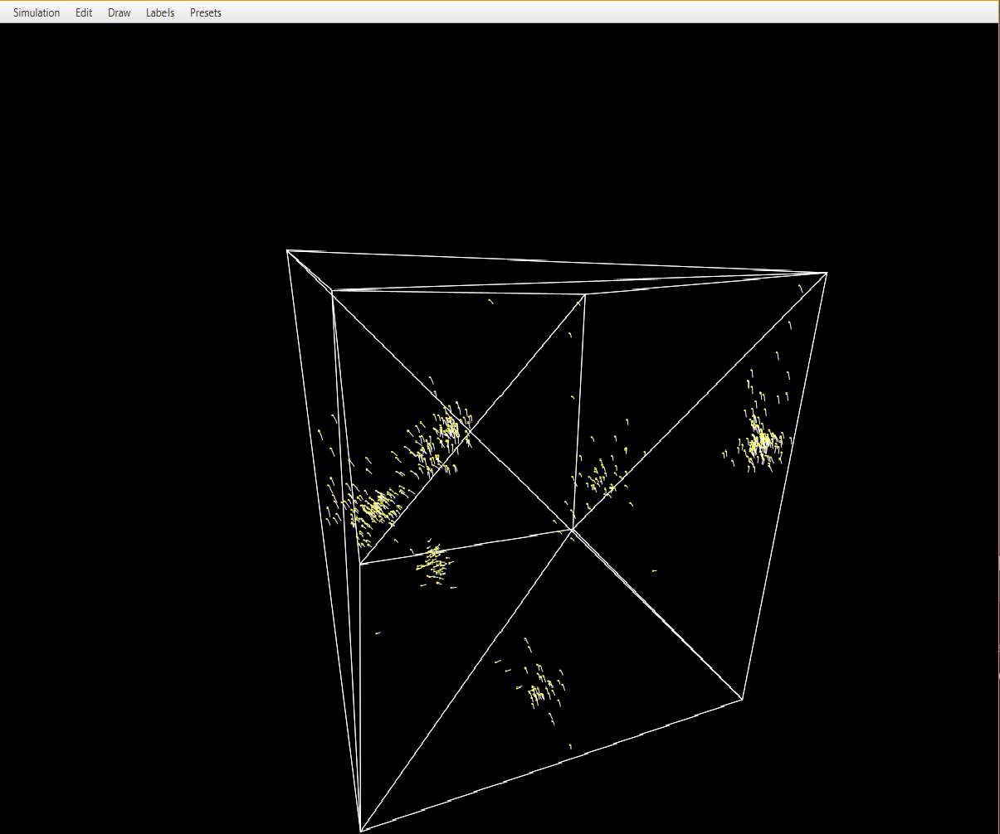

# Flocking simulation 

The application simulates the behaviour of birds in flocks.

The birds have a set of rules that determine their behaviour in the flocks. 
Those rules consist of separation, alignment and cohesion that were created by Craig Reynolds:
https://www.red3d.com/cwr/boids/

Each object is drawn as a yellow circle with a white line pointing in the direction of its velocity.

The birds can be drawn either in 2D or 3D.

## Features
- The simulation mode (2D/3D) can be changed
  - Edit -> Change mode to 2D/3D
- The behaviour of the flocks can be changed by changing the sliders that modify
  - the mass of a single bird
  - the max force that can be exerted to a single bird 
  - the max speed of a single bird
  - the cohesion coefficient and radius
  - the alignment coefficient and radius
  - the separation coefficient and radius
- The slider values can be saved as a 'preset' and used later 
  - The values are stored in a separate json file that is located in 
    ../main/resources/presets/name_of_preset.json
  - Simulation -> save
  - Preset -> name_of_the_preset
- The Frames per second and Ticks per second -values can be seen 
  - Labels -> Labels on/Labels off 
- The camera can be controlled in 3D
  - WASD to move and IJKL to look around
- The number of birds in 2D can (only) be changed when first launching the simulation
  - Click 2D -> a dialog will pop up

The number of birds drawn in 2D/3D can be changed by deleting/adding lines to the .txt files in
../main/resources/initialCoordinates/initialCoordinates2D/3D.txt  

The coordinates can be generated in ../main/scala/createCoordinates.scala

## Controls in 3D 

The 3D uses WASD to move and IJKL to look around

| Key   | Description    |
|-------|----------------|
| W     | Move forwards  |
| A     | Move left      |
| S     | Move backwards |
| D     | Move right     |
| Space | Move up        |
| Z     | Move down      |
| I     | Look up        |
| J     | Look left      |
| K     | Look down      |
| L     | Look right     |